# ERD (Rodrigo)

Origem: `ERD-Rodrigo.mmd`.
Arquivo original (Oficial): https://drive.google.com/file/d/1YVhr-P_IueMGotAaoF6QjXEPuqmGqqe4/view

> Observação: este ERD descreve entidades e relacionamentos (formato Mermaid ER diagram).

```mermaid
erDiagram

%% =====================================================
%% ACCESS MANAGEMENT
%% =====================================================

Enterprise {
  UUID UniqueID PK
  String Name
  Date Create_Date
  Boolean Status
}

Group {
  UUID UniqueID PK
  String Name
  Date Create_Date
  Boolean Status
}

Profile {
  UUID UniqueID PK
  String Name
  Date Create_Date
  Boolean Status
}

PermissionAcess_Associate {
  UUID UniqueID PK
  UUID IdEnterprise FK
  UUID IdGroup FK
  UUID IdProfile FK
  UUID IdMacroAcess FK
  Date Create_Date
  Boolean Status
}

UserAcess {
  UUID UniqueID PK
  UUID IdPermissionAcess FK
  String Login
  String Password
  String Token
  Date Create_Date
  Boolean Status
}

FunctionType {
  UUID UniqueID PK
  String Name
  Date Create_Date
  Boolean Status
}

MacroAcess {
  UUID UniqueID PK
  UUID IdFunctionType FK
  String Name
  Date Create_Date
  Boolean Status
}

Enterprise ||--o{ PermissionAcess_Associate : contains
Group ||--o{ PermissionAcess_Associate : contains
Profile ||--o{ PermissionAcess_Associate : contains
MacroAcess ||--o{ PermissionAcess_Associate : contains
PermissionAcess_Associate ||--o{ UserAcess : grants
FunctionType ||--o{ MacroAcess : defines

%% =====================================================
%% PERSON CORE
%% =====================================================

Person {
  UUID UniqueID PK
  UUID IdUserAcess FK
  UUID IdPersonType FK
  UUID IdLevelType FK
  UUID IdOriginCountry FK
  String DocumentNumber
  Date Create_Date
  Boolean Status
}

PersonType {
  UUID UniqueID PK
  String Name
}

LevelType {
  UUID UniqueID PK
  String Name
}

OriginCountry {
  UUID UniqueID PK
  String Name
}

UserAcess ||--|| Person : associated
PersonType ||--o{ Person : typed
LevelType ||--o{ Person : leveled
OriginCountry ||--o{ Person : from

%% =====================================================
%% PERSON DETAILS
%% =====================================================

IndividualPersonData {
  UUID UniqueID PK
  UUID IdPerson FK
  String Name
  Date Born_Date
}

LegalPersonData {
  UUID UniqueID PK
  UUID IdPerson FK
  String Name
  String FantasyName
  Number BillingDeadlineDays
}

Person ||--|| IndividualPersonData : has
Person ||--|| LegalPersonData : has

%% =====================================================
%% CONTACT / ADDRESS / BANK
%% =====================================================

Contacts {
  UUID UniqueID PK
  UUID IdContactType FK
  String Email
  String PhoneNumber
}

ContactType {
  UUID UniqueID PK
  String Name
}

Person_Contacts_Associate {
  UUID UniqueID PK
  UUID IdPerson FK
  UUID IdContacts FK
}

ContactType ||--o{ Contacts : typed
Person ||--o{ Person_Contacts_Associate : has
Contacts ||--o{ Person_Contacts_Associate : associated

Address {
  UUID UniqueID PK
  UUID IdOriginCountry FK
  UUID IdTypeAddress FK
  String City
  String State
}

TypeAddress {
  UUID UniqueID PK
  String Name
}

Person_Address_Associate {
  UUID UniqueID PK
  UUID IdPerson FK
  UUID IdAddress FK
}

OriginCountry ||--o{ Address : in
TypeAddress ||--o{ Address : typed
Person ||--o{ Person_Address_Associate : has
Address ||--o{ Person_Address_Associate : associated

BankAccount {
  UUID UniqueID PK
  UUID IdBank FK
  UUID IdAccountType FK
}

Bank {
  UUID UniqueID PK
  String Code
  String Name
}

AccountType {
  UUID UniqueID PK
  String Name
}

Person_BankAccount_Associate {
  UUID UniqueID PK
  UUID IdPerson FK
  UUID IdBankAccount FK
}

Bank ||--o{ BankAccount : has
AccountType ||--o{ BankAccount : typed
Person ||--o{ Person_BankAccount_Associate : has
BankAccount ||--o{ Person_BankAccount_Associate : associated

%% =====================================================
%% CHANNEL
%% =====================================================

Channel {
  UUID UniqueID PK
  UUID IdCategoryType FK
  UUID IdChannelType FK
  UUID IdOriginPartner FK
  String SiteName
}

CategoryType {
  UUID UniqueID PK
  String Name
}

ChannelType {
  UUID UniqueID PK
  String Name
}

OriginPartner {
  UUID UniqueID PK
  String Name
}

Person_Channel_Associate {
  UUID UniqueID PK
  UUID IdPerson FK
  UUID IdChannel FK
}

CategoryType ||--o{ Channel : categorizes
ChannelType ||--o{ Channel : typed
OriginPartner ||--o{ Channel : provides
Person ||--o{ Person_Channel_Associate : has
Channel ||--o{ Person_Channel_Associate : associated

%% =====================================================
%% CAMPAIGN
%% =====================================================

Campaign {
  UUID UniqueID PK
  UUID IdCommercialManager FK
  UUID IdSegmentationType FK
  UUID IdCategoryType FK
  UUID IdCountryCurrency FK
  String Name
}

CommercialManager {
  UUID UniqueID PK
  String Name
}

SegmentationType {
  UUID UniqueID PK
  String Name
}

CountryCurrency {
  UUID UniqueID PK
  String Code
}

Person_Campaign_Associate {
  UUID UniqueID PK
  UUID IdPerson FK
  UUID IdCampaign FK
}

CommercialManager ||--o{ Campaign : manages
SegmentationType ||--o{ Campaign : segments
CategoryType ||--o{ Campaign : categorizes
CountryCurrency ||--o{ Campaign : uses

Person ||--o{ Person_Campaign_Associate : participates
Campaign ||--o{ Person_Campaign_Associate : associated

%% =====================================================
%% CREATIVE
%% =====================================================

Creative {
  UUID UniqueID PK
  UUID IdCreativeStep FK
  UUID IdCreativeType FK
  UUID IdCreativeCategoryType FK
}

CreativeStep {
  UUID UniqueID PK
  String Name
}

CreativeType {
  UUID UniqueID PK
  String Name
}

CreativeCategoryType {
  UUID UniqueID PK
  String Name
}

Creative_Campaign_Channel_Associate {
  UUID UniqueID PK
  UUID IdCreative FK
  UUID IdCampaign FK
  UUID IdChannel FK
}

CreativeStep ||--o{ Creative : defines
CreativeType ||--o{ Creative : typed
CreativeCategoryType ||--o{ Creative : categorizes

Creative ||--o{ Creative_Campaign_Channel_Associate : used
Campaign ||--o{ Creative_Campaign_Channel_Associate : has
Channel ||--o{ Creative_Campaign_Channel_Associate : uses

%% =====================================================
%% POSTBACK
%% =====================================================

AfiliatedPostback {
  UUID UniqueID PK
  UUID IdParameterType FK
}

NParameterType {
  UUID UniqueID PK
  String Name
}

PostbackParameters {
  UUID UniqueID PK
  UUID IdAffiliatePostback FK
}

Postback_Campaign_Channel_Associate {
  UUID UniqueID PK
  UUID IdPerson FK
  UUID IdAffiliatePostback FK
  UUID IdCampaign FK
  UUID IdChannel FK
}

NParameterType ||--o{ AfiliatedPostback : defines
AfiliatedPostback ||--o{ PostbackParameters : has
AfiliatedPostback ||--o{ Postback_Campaign_Channel_Associate : sends
Person ||--o{ Postback_Campaign_Channel_Associate : receives
Campaign ||--o{ Postback_Campaign_Channel_Associate : tracks
Channel ||--o{ Postback_Campaign_Channel_Associate : tracks

%% =====================================================
%% LINK SHORTENER
%% =====================================================

LinkType {
  UUID UniqueID PK
  String Name
  Date Create_Date
  Boolean Status
}

LinkShortener {
  UUID UniqueID PK
  UUID IdLinkType FK

  String Url
  String TempUrl
  String Source

  Boolean TempRedirect
  Number HitCount
  String OriginEnv
  Number BlockParams

  Date Create_Date
  Date Modified_Date
  Boolean Status
}

Link_Campaign_Channel_Creative_Associate {
  UUID UniqueID PK
  UUID IdLinkShortener FK
  UUID IdCampaign FK
  UUID IdChannel FK
  UUID IdCreative FK

  Date Create_Date
  Boolean Status
}

RedirectLinkShortener {
  UUID UniqueID PK
  UUID IdLinkShortener FK

  String Root_Tstamp
  String Ip
  String Referral
  String Utm

  String IdClick
  String Uuid
  String CustomUrl

  Date Create_Date
  Boolean Status
}

RedirectLinkShortener_Error {
  UUID UniqueID PK
  UUID IdRedirectLinkShortener FK

  String Error
  String UrlParameters
  String RemoteAddress
  String UserAgent
  String LinkId

  Date Create_Date
  Boolean Status
}

%% =====================================================
%% CONVERSION
%% =====================================================

Conversion {
  UUID UniqueID PK

  UUID IdLinkShortener FK
  UUID IdRedirectLinkShortener FK

  UUID IdCampaign FK
  UUID IdChannel FK
  UUID IdCreative FK
  UUID IdPerson FK

  String ExternalOrderId
  String ConversionType

  Decimal GrossValue
  Decimal PlatformCommissionValue
  Decimal AffiliateCommissionValue

  String Currency

  String CommissionType
  Decimal CommissionPercent
  Decimal CommissionFixedValue

  String AttributionModel

  Date ClickTimestamp
  Date ConversionTimestamp

  Date Create_Date
}
ConversionStatus {
  UUID UniqueID PK
  UUID IdConversion FK

  String Status
  Timestamp ChangedAt
  String ChangedBy
  String Reason

  Boolean IsCurrent
}

Conversion_Error {
  UUID UniqueID PK
  UUID IdConversion FK

  String Error
  String RemoteAddress
  String UserAgent

  Date Create_Date
  Boolean Status
}

%% =====================================================
%% RELATIONSHIPS
%% =====================================================

LinkType ||--o{ LinkShortener : typed

LinkShortener ||--o{ RedirectLinkShortener : generates
RedirectLinkShortener ||--o{ RedirectLinkShortener_Error : logs

LinkShortener ||--o{ Link_Campaign_Channel_Creative_Associate : mapped
Campaign ||--o{ Link_Campaign_Channel_Creative_Associate : has
Channel ||--o{ Link_Campaign_Channel_Creative_Associate : uses
Creative ||--o{ Link_Campaign_Channel_Creative_Associate : uses

LinkShortener ||--o{ Conversion : traced_by
RedirectLinkShortener ||--|| Conversion : originates

Conversion ||--o{ ConversionStatus : has_history
Conversion ||--o{ Conversion_Error : logs

Campaign ||--o{ Conversion : generates
Channel ||--o{ Conversion : generates
Creative ||--o{ Conversion : generates
Person ||--o{ Conversion : earns
```

