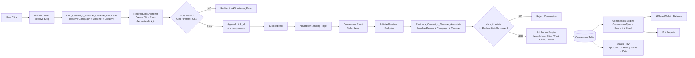

# Fluxo End-to-End (Clique → Conversão → Pagamento)

Origem: `flow-end-to-end.mmd`.

```mermaid
flowchart LR

User[User Click] --> ShortLink[LinkShortener
Resolve Slug]

ShortLink --> LinkMap[Link_Campaign_Channel_Creative_Associate
Resolve Campaign + Channel + Creative]

LinkMap --> ClickLog[RedirectLinkShortener
Create Click Event
Generate click_id]

ClickLog --> Validation{Bot / Fraud /
Geo / Params OK?}

Validation -->|NO| ErrorLog[RedirectLinkShortener_Error]

Validation -->|YES| AppendClick[Append click_id
+ utm + params]

AppendClick --> Redirect[302 Redirect]

Redirect --> Advertiser[Advertiser Landing Page]

Advertiser --> ConversionEvent[Conversion Event
Sale / Lead]

ConversionEvent --> PostbackAPI[AfiliatedPostback
Endpoint]

PostbackAPI --> PostbackMap[Postback_Campaign_Channel_Associate
Resolve Person + Campaign + Channel]

PostbackMap --> ValidateClick{click_id exists
in RedirectLinkShortener?}

ValidateClick -->|NO| Reject[Reject Conversion]

ValidateClick -->|YES| Attribution[Attribution Engine
Model: Last Click / First Click / Linear]

Attribution --> ConversionDB[(Conversion Table)]

ConversionDB --> CommissionCalc[Commission Engine
CommissionType + Percent + Fixed]

CommissionCalc --> Payment[Affiliate Wallet / Balance]

CommissionCalc --> Dashboard[BI / Reports]

ConversionDB --> StatusFlow[Status Flow
Approved → ReadyToPay → Paid]
```
