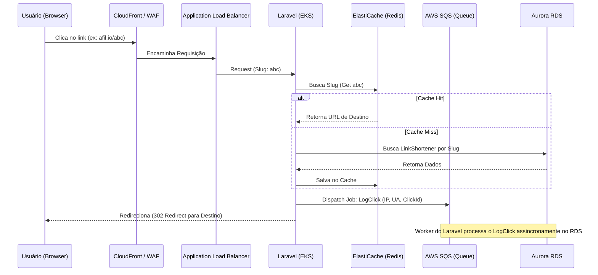

# Sequência: Clique (Tracker)

Origem: `tranck-sequence-diagram.mmd`.

```mermaid
sequenceDiagram
    participant U as Usuário (Browser)
    participant CF as CloudFront / WAF
    participant ALB as Application Load Balancer
    participant L as Laravel (EKS)
    participant R as ElastiCache (Redis)
    participant SQS as AWS SQS (Queue)
    participant RDS as Aurora RDS

    U->>CF: Clica no link (ex: afil.io/abc)
    CF->>ALB: Encaminha Requisição
    ALB->>L: Request (Slug: abc)

    L->>R: Busca Slug (Get abc)
    alt Cache Hit
        R-->>L: Retorna URL de Destino
    else Cache Miss
        L->>RDS: Busca LinkShortener por Slug
        RDS-->>L: Retorna Dados
        L->>R: Salva no Cache
    end

    L->>SQS: Dispatch Job: LogClick (IP, UA, ClickId)
    L-->>U: Redireciona (302 Redirect para Destino)

    Note over SQS, RDS: Worker do Laravel processa o LogClick assincronamente no RDS
```
