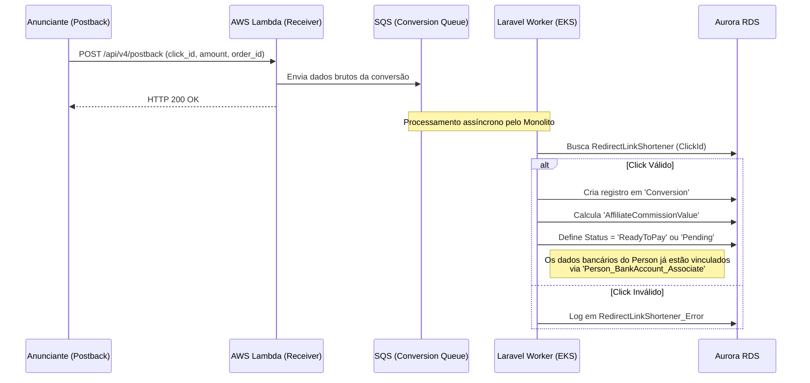

# Sequência: Conversão (Postback → Lambda → SQS → Worker)

Origem: `conversion-sequence-diagram.mmd`.

```mermaid
sequenceDiagram
    participant A as Anunciante (Postback)
    participant Lmb as AWS Lambda (Receiver)
    participant SQS as SQS (Conversion Queue)
    participant W as Laravel Worker (EKS)
    participant RDS as Aurora RDS

    A->>Lmb: POST /api/v4/postback (click_id, amount, order_id)
    Lmb->>SQS: Envia dados brutos da conversão
    Lmb-->>A: HTTP 200 OK

    Note over SQS, W: Processamento assíncrono pelo Monolito
    W->>RDS: Busca RedirectLinkShortener (ClickId)

    alt Click Válido
        W->>RDS: Cria registro em 'Conversion'
        W->>RDS: Calcula 'AffiliateCommissionValue'
        W->>RDS: Define Status = 'ReadyToPay' ou 'Pending'
        Note right of W: Os dados bancários do Person já estão vinculados <br/> via 'Person_BankAccount_Associate'
    else Click Inválido
        W->>RDS: Log em RedirectLinkShortener_Error
    end
```
