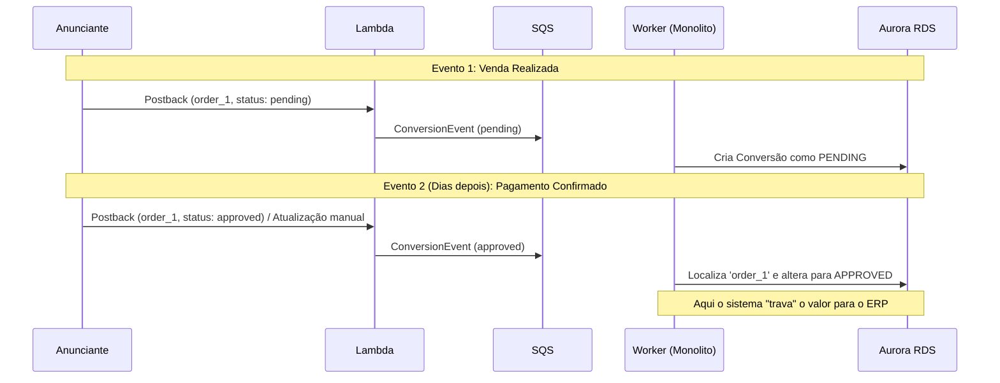

# Sequência: Status da Conversão

Origem: `sequencia-conversion-status.mmd`.

```mermaid
sequenceDiagram
    participant A as Anunciante
    participant L as Lambda
    participant S as SQS
    participant W as Worker (Monolito)
    participant RDS as Aurora RDS

    Note over A, RDS: Evento 1: Venda Realizada
    A->>L: Postback (order_1, status: pending)
    L->>S: ConversionEvent (pending)
    W->>RDS: Cria Conversão como PENDING

    Note over A, RDS: Evento 2 (Dias depois): Pagamento Confirmado
    A->>L: Postback (order_1, status: approved) / Atualização manual
    L->>S: ConversionEvent (approved)
    W->>RDS: Localiza 'order_1' e altera para APPROVED

    Note over W, RDS: Aqui o sistema "trava" o valor para o ERP
```
